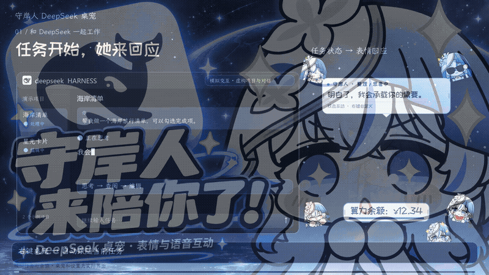
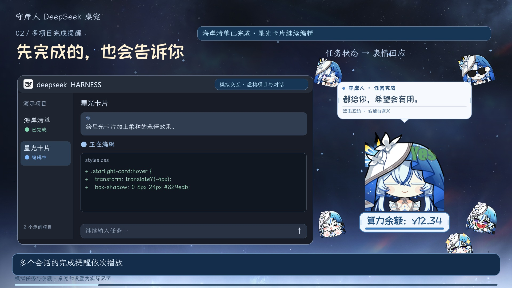
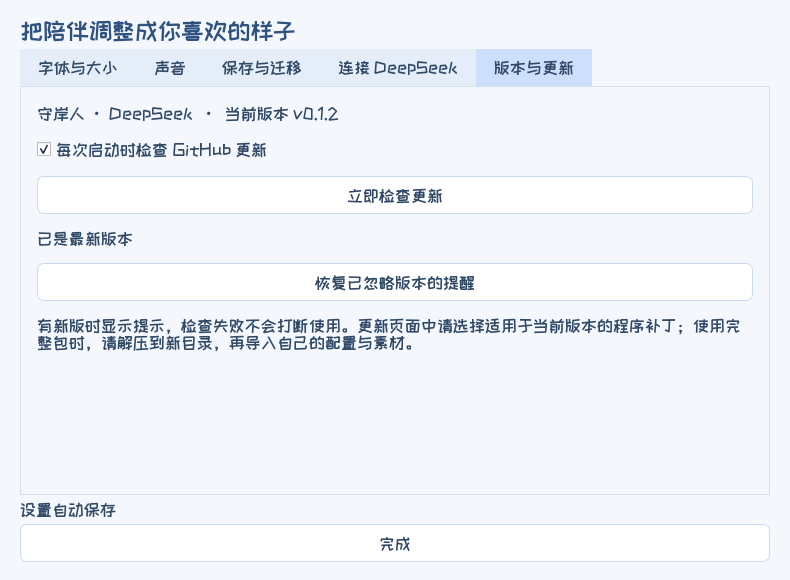
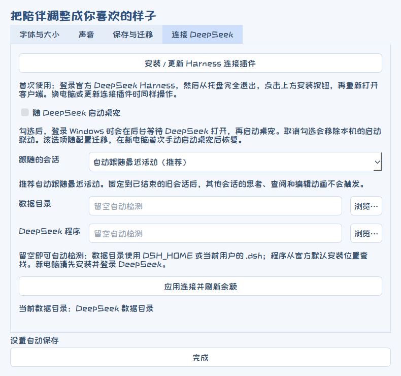
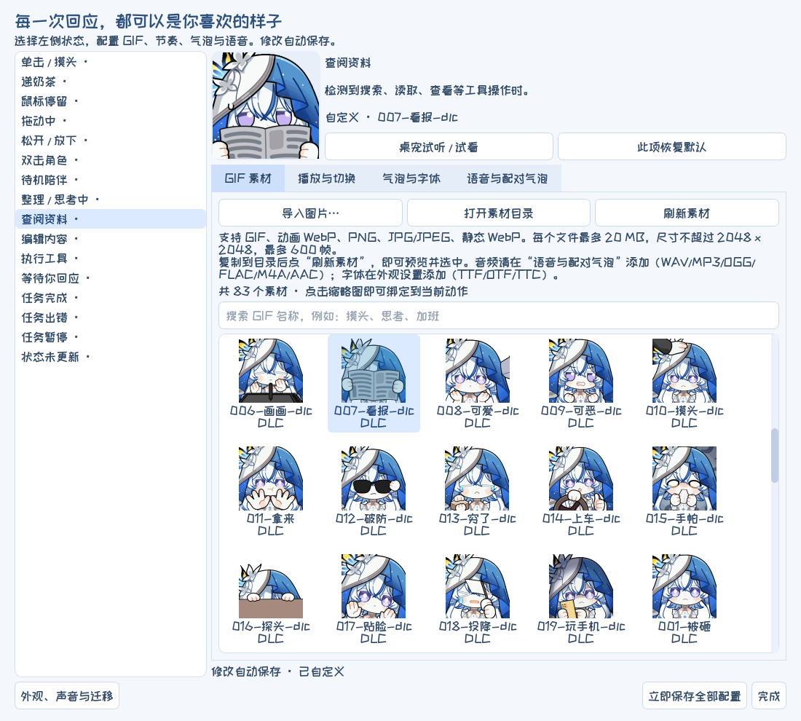
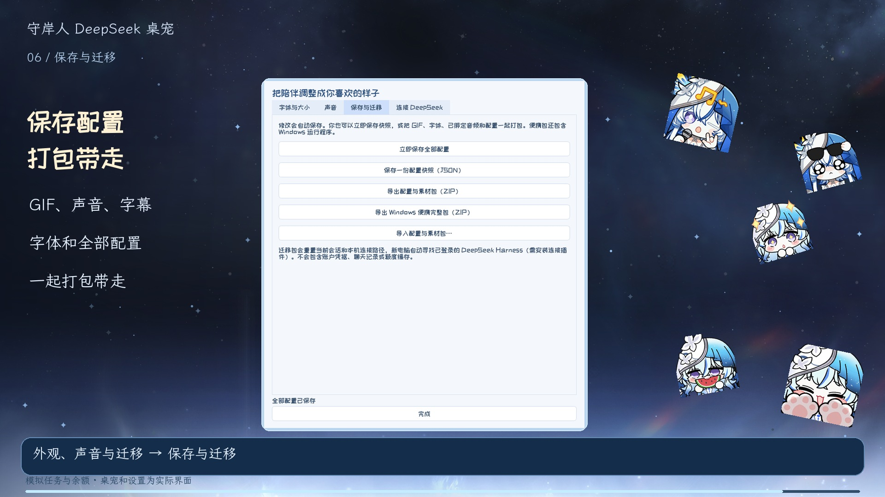

# Shorekeeper DeepSeek Desktop Pet

**A companion for the official DeepSeek Harness Windows client, with custom expressions, voice clips, and speech bubbles.**

[Download for Windows](https://github.com/Doya16/shorekeeper-deepseek-pet/releases/latest) · [Watch the demo](https://github.com/Doya16/shorekeeper-deepseek-pet/releases/download/v0.1.0/shorekeeper-landscape-deepseek-v010.mp4) · [User guide (Chinese)](docs/USAGE.md) · [Report an issue](https://github.com/Doya16/shorekeeper-deepseek-pet/issues) · [中文](README.md)


[Landscape cover](docs/social/cover-landscape.jpg) · [4:3 cover](docs/social/cover-4x3.jpg) · [Portrait cover](docs/social/cover-portrait.jpg)

For **Windows 10/11 x64**. The complete package includes **three packs with 83 GIFs, 40 audio files, 54 voice/caption pairs, and two fonts**. No Python installation is required. It can run alongside the [Codex edition](https://github.com/Doya16/shorekeeper-codex-pet), with separate settings.

## Preview



[Landscape demo](https://github.com/Doya16/shorekeeper-deepseek-pet/releases/download/v0.1.0/shorekeeper-landscape-deepseek-v010.mp4) · [Portrait demo](https://github.com/Doya16/shorekeeper-deepseek-pet/releases/download/v0.1.0/shorekeeper-portrait-deepseek-v010.mp4)

Recorded with **v0.1.0**, the roughly two-minute demo covers task states, concurrent completion notifications, mouse interactions, GIF selection, voice/caption pairs, playback frequency, resizing, account balance, and portable export. The Harness window, projects, dialogue, and balance are simulated examples; the pet and settings show actual widgets from that release. Later features, including update notifications, are described below.



## Get started

1. Install the Windows client from the [official DeepSeek Harness website](https://www.deepseek.com/harness/), open it, and sign in.
2. Download [Shorekeeper-DeepSeek-Windows-v0.1.2.zip](https://github.com/Doya16/shorekeeper-deepseek-pet/releases/download/v0.1.2/Shorekeeper-DeepSeek-Windows-v0.1.2.zip), extract it completely, and run **守岸人DeepSeek桌宠启动.exe**.
3. Fully quit Harness from its tray menu. Right-click the pet → **外观、声音与迁移 → 连接 DeepSeek → 安装 / 更新 Harness 连接插件** (Appearance, Sound & Migration → Connect to DeepSeek → Install / Update Harness Connection Plugin).
4. Reopen Harness and start a task. The pet follows the most recently active conversation.

Repeat steps 3–4 when updating the connection plugin. No additional API key is required. The tested client is **DeepSeek Harness 0.2.0-rc.2 / Windows x64**.

## Checking for updates and keeping your settings

Current version: **v0.1.2**. After each launch, the pet checks GitHub for a stable release and prompts you when a newer one is available. Right-click → **检查更新…** (Check for updates) to check manually.

Open **外观、声音与迁移 → 版本与更新** (Appearance, Sound & Migration → Version & Updates) to disable startup checks, check immediately, or restore ignored version reminders. A new-version prompt lets you open the release page, back up settings and media, remind you later, or ignore that version. A failed background check does not interrupt the pet.



**Updates are downloaded and installed manually.** Choose the package for your installed version:

| Your installation | How to update |
| --- | --- |
| v0.1.1 | Download the [v0.1.2 program patch](https://github.com/Doya16/shorekeeper-deepseek-pet/releases/download/v0.1.2/Shorekeeper-DeepSeek-Update-Check-Patch-v0.1.2.zip), exit the pet, extract over its existing folder, and restart |
| New installation or another older version | Extract the [v0.1.2 full package](https://github.com/Doya16/shorekeeper-deepseek-pet/releases/download/v0.1.2/Shorekeeper-DeepSeek-Windows-v0.1.2.zip) into a new folder, then import your exported settings and assets ZIP if you have one |

The program patch preserves **GIFs / images, audio, bubble captions, fonts, and personal settings**. Before updating, use **保存与迁移 → 导出配置与素材包（ZIP）** (Save & Migrate → Export Settings & Assets ZIP) to keep a backup. Extract program patches into the application folder; do not import them as settings.

## Features

- **Task expressions:** separate GIFs for thinking, reading, editing, running tools, waiting for you, completion, errors, and pauses. Concurrent completions are queued individually.
- **Voices and captions:** add several clips to one action, pair each with its own text, and play a randomly selected pair. Automatic GIF changes allow the current voice to finish. Thinking speech defaults to once per turn; idle speech can play on every entry, once per launch, or occasionally.
- **Custom animations:** choose a bundled GIF or add your own image; adjust speed, looping, single playback, hold time, and the next state.
- **Resizing:** use Ctrl + mouse wheel to scale the pet. Drag the edges of bubbles and the balance badge, or preview their sizes in settings. Their saved proportions scale with the pet.
- **Mouse interactions:** configure separate GIFs, voices, and bubbles for head pats, double-clicking, dragging, dropping, hovering, and feeding.
- **Account balance:** show the combined purchased and bonus balance below the pet. Right-click to refresh or hover for currency and details. `*` indicates cached data; `--` means no data is available.
- **Launch with Harness:** enable the option in the DeepSeek connection tab. Click the tray icon to show or hide the pet.
- **Update reminders:** startup and manual checks, with remind-later and ignore-version options.
- **Audio and tray labels:** Windows Volume Mixer lists **守岸人 · DeepSeek** for separate volume control. The tray tooltip also identifies the DeepSeek edition.
- **Save and migrate:** changes save automatically; export settings and media or a complete portable application.

| Voice playback frequency | Connection and startup |
| --- | --- |
|  |  |

## Customization

Right-click the pet → **交互工作室** (Interaction Studio). Select an action, then adjust its expression, bubble, and voice.

| What to change | Where to find it |
| --- | --- |
| GIF or image for each action | **GIF 素材** (GIF assets) → choose a thumbnail |
| Add your own assets | Import images, or open the asset folder, add files, and refresh |
| Looping, speed, hold time, next state | **播放与切换** (Playback & Transitions) |
| Multiple voices, each with its own caption | **语音与配对气泡** (Voices & Paired Bubbles) → add files → select one to edit |
| Show only the selected voice's caption | **气泡与字体 → 气泡内容 → 自定义音频+字幕** (Bubbles & Fonts → Bubble Content → Custom Audio + Subtitles) |
| Bubble width and balance badge size | Right-click → **调整大小** (Resize), or drag their left/right edges |

| Custom expressions | Paired voices and captions |
| --- | --- |
|  |  |

Supported images: GIF, animated WebP, PNG, JPG/JPEG, and static WebP. Audio: WAV, MP3, OGG, FLAC, M4A, and AAC. Fonts: TTF, OTF, and TTC. Place a UTF-8 TXT file with the same base name beside an audio file to import its caption. The pet also works without added audio.

## Moving to another computer



Right-click → **外观、声音与迁移 → 保存与迁移 → 导出 Windows 便携完整包** (Appearance, Sound & Migration → Save & Migrate → Export Complete Portable Windows Package).

Extract the package on the new computer, install and sign in to Harness, launch the pet, and install the connection plugin from its connection settings. Your GIFs, fonts, voices, captions, and settings travel with the package. Account credentials and chat history are not included.

You can also import a Codex-edition settings and assets package to reuse your expressions, audio, captions, fonts, and animation preferences. Configure the DeepSeek connection separately.

## Compatibility

- Connects to the official Harness desktop client; ordinary DeepSeek browser chats are outside this edition's scope.
- Tasks started after installing the plugin appear in the pet's conversation list with numbered DeepSeek labels.
- “Thinking” indicates a task stage. Bubble text comes from your configured lines and captions.
- The v0.1.0 integration was tested with Harness **0.2.0-rc.2**, including real tasks, waiting for input, resuming, cancellation, and concurrent completions. See [validation notes](docs/VALIDATION.md).

## Asset sources and acknowledgments

Expression assets come from the [Wuthering Waves emoji collection](https://emoji.wuwa.games/). Crowdfunding QQ group: **1079834905**.

Thank you to all the Shorekeeper fans who funded the expression packs used in this project. See [third-party credits](THIRD_PARTY.txt) for fonts, character voices, and other assets.

<details>
<summary>Run from source</summary>

Install Python 3.11+ and run these commands in the project directory:

```powershell
python -m venv .venv
.venv\Scripts\python -m pip install -r requirements.txt
.venv\Scripts\python tools\run_pet.py
```

```powershell
.venv\Scripts\python -m unittest discover -s tests
node --test integrations/deepseek/state.test.js
.venv\Scripts\python tools\build_portable.py
```

</details>
